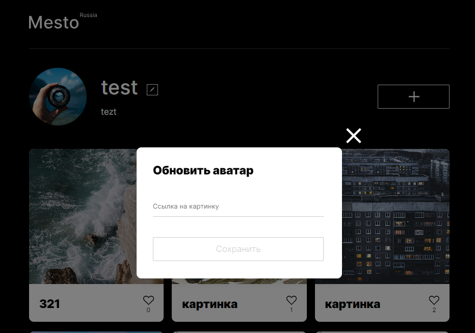

# Проект: Место React

[Ссылка на GitHub Pages](https://yaroslav-chertov.github.io/mesto-react/)

## Описание и функциональность

Работа представляет из себя одностраничный сайт, аналог социальной сети, где есть возможность добавлять фотографии, ставить лайки и редактировать свой профиль. Выполнена на React.



Функционал:

* Редактирование имени и подписи в профиле пользователя;
* Редактирование аватара пользователя;
* Добавление новых фотографий;
* Возможность посмотреть отдельно любую фотографию;
* Возможность ставить лайки и удалять фотографии.

Технологии:

* Grid Layout;
* Flexbox;
* JavaScript;
* БЭМ методология, файловая структура;
* ООП и разбиение на модули;
* Webpack;
* React JS.

Выводы:

* Изначально проект был выполнен на чистом Js, затем переведен на React. Это позволило задействовать более быстрый рендеринг и компонентный подход. Часть компонентов можно легко переиспользовать. Также я бы отметил более аккуратный синтаксис JSX.

## Инструкция по установке

Клонировать репозиторий:

`
git clone https://github.com/Yaroslav-Chertov/mesto-react.git
`

В директории проекта запустить приложение в режиме разработки:

```
npm install
npm start
```
